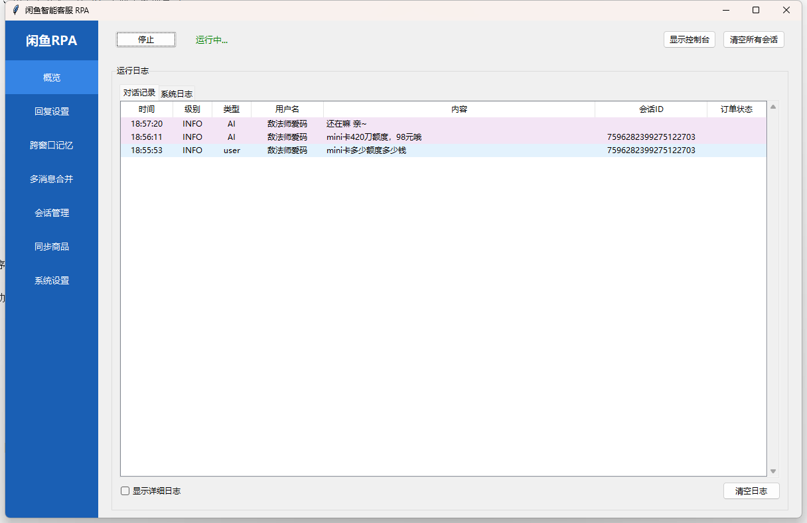
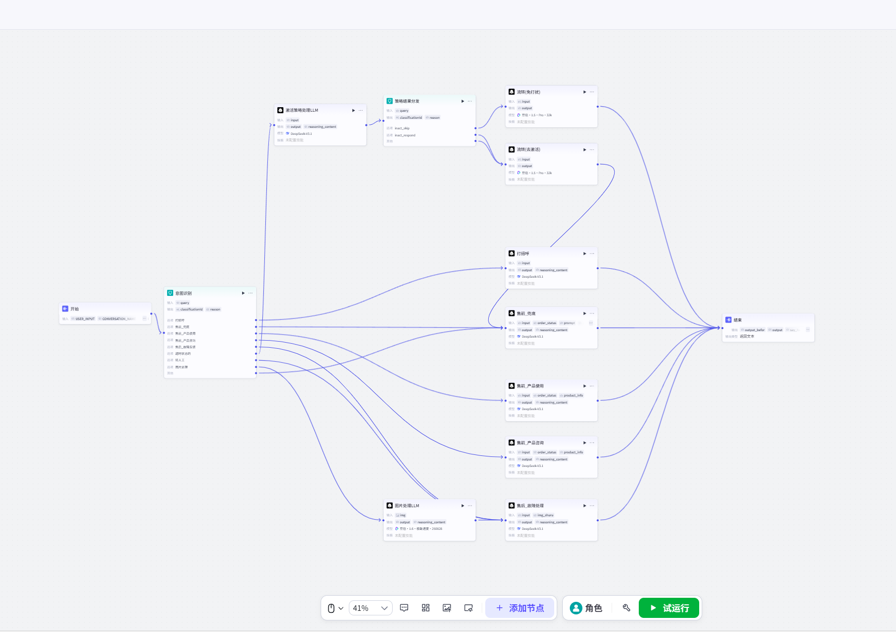
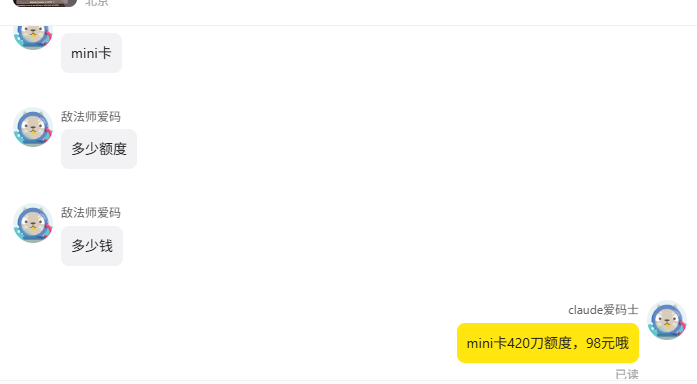
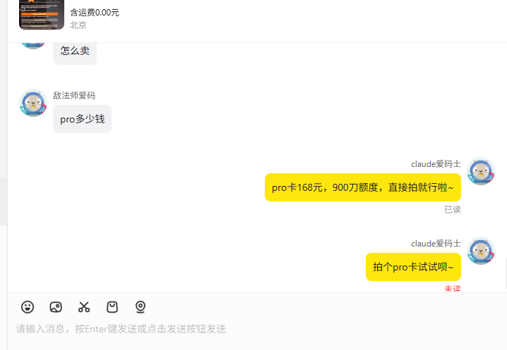
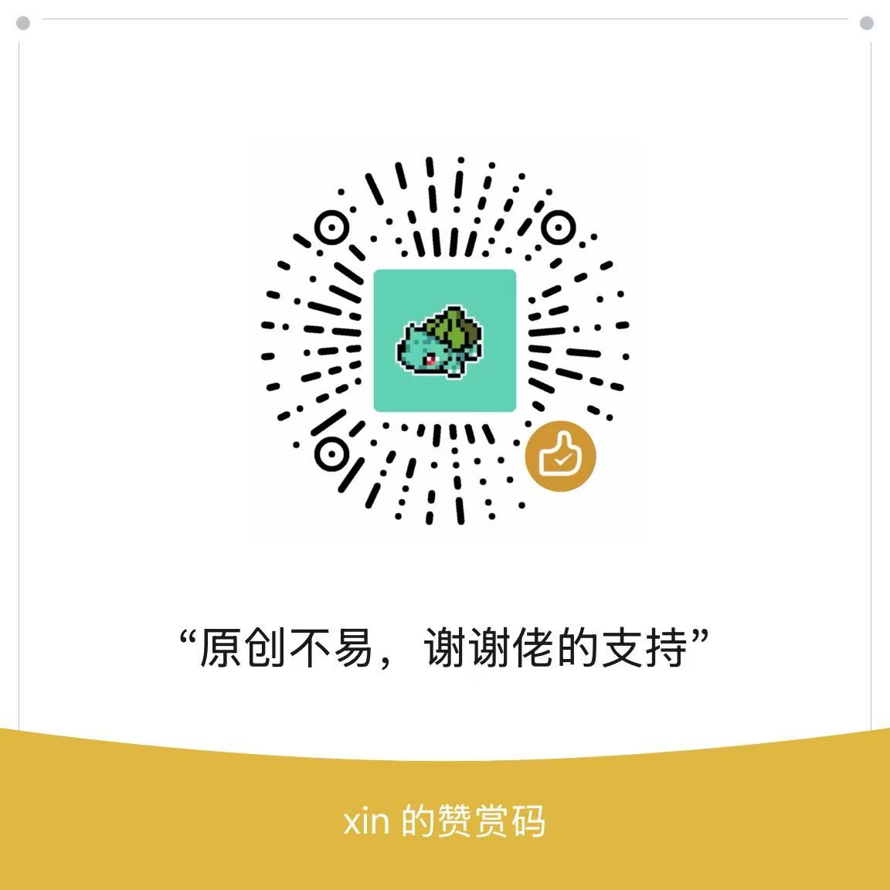

# 🤖 Xianyu Smart2.0 - 闲鱼智能客服系统

  

专为闲鱼小商家打造的AI智能客服，经本人真实店铺实战打磨，懂人话不废话，会主动聊出单，支持多模态理解、消息聚合回复、跨会话记忆，支持后台静默运行，边挂机边工作，互不干扰。稳定可靠。

## ✨ 核心特性

### 🖼️ 多模态识别

| 能力 | 说明 |
|------|------|
| 图片理解 | 用户发送报错截图、商品图片，AI 自动识别并准确回复 |
| 全场景覆盖 | 售前咨询 + 售后问题处理，一套系统全搞定 |

### 🎯 真实场景适配

| 功能 | 解决的问题 |
|------|------------|
| 消息队列聚合 | 用户连发多条消息时，合并理解后统一回复，避免"已读乱回" |
| 丰富的上下文传感器 | 每次对话携带商品信息、订单状态、用户标签、历史上下文，让 AI 全面了解场景 |
| 跨会话记忆 | 用户切换商品窗口咨询，对话记忆不丢失 |
| 主动激活机制 | 用户沉默时智能判断是否跟进，避免客户流失 |

### 🔗 深度融入闲鱼平台

| 功能 | 说明 |
|------|------|
| 跨窗口会话管理 | 多个聊天窗口并行处理，互不干扰 |
| 一键同步商品 | 商品信息一键同步到知识库，无需手动维护 |

&nbsp;

## 📊 功能矩阵

| 模块 | 已实现 | 规划中 |
|------|--------|--------|
| 对话引擎 | ✅ LLM自动回复 ✅ 多模态图片理解 ✅ 上下文记忆 |
| 消息处理 | ✅ 消息队列聚合 ✅ 跨会话记忆 |
| 场景识别 | ✅ 售前/售后路由 ✅ 意图识别 |
| 平台集成 | ✅ 闲鱼窗口管理 ✅ 商品信息同步 |
| 主动营销 | ✅ 沉默用户激活 |

&nbsp;

## 🚀 不是 Demo，是真实场景打磨出来的系统

| 普通客服机器人 | 我们 |
|----------------|------|
| ❌ 用户发3条消息，回3条答非所问 | ✅ 聚合理解，一条精准回复 |
| ❌ 换个商品问，AI 一脸懵 | ✅ 跨窗口记忆，上下文不丢 |
| ❌ 用户发图片，已读不回 | ✅ 多模态理解，截图也能答 |

&nbsp;

## 系统界面

  
  
RPA系统

  
  
coze对话流

## 效果图

  
  
消息聚合回复示例

  
  
用户沉默不回复，agent感知到用户意图，主动发消息引导用户下单

&nbsp;

&nbsp;

## 安装教程
https://ecncmtdnxdpn.feishu.cn/wiki/CCsYwBzXYir18Akf8SecnYqunEf

&nbsp;

&nbsp;

## 📱 交流群
欢迎加入项目交流群，交流技术、分享经验、互助学习。

  

&nbsp;

## 💼 寻找机会
🔍 寻求方向：AI产品经理
📫 WX：15701327230； Email：740074553@qq.com

&nbsp;

## ❤️ 赞助支持
制作不易，感谢佬友的支持~ 祝发财

  <table>
    <tr>
      <td align="center">
        
         
      </td>
      <td align="center">
        
         
      </td>
    </tr>
  </table>

